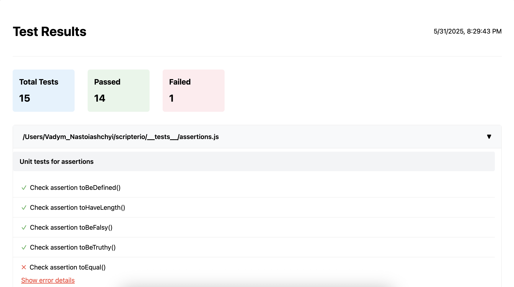
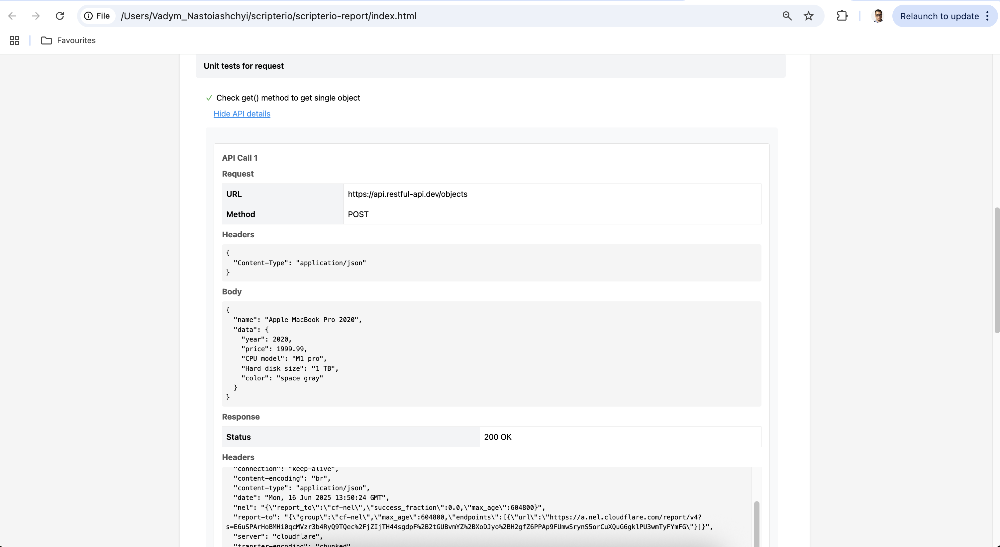

<p align="center">
  
</p>

<p align="center">
<b>ScripterI/O - Simple, fast, dependency-free, ESM (ECMA script modules) runner for testing all JavaScript</b>
</p>

<h2>Links:</h2>

<p align="left">
  <a href="https://scripterio-js.github.io/scripterio/">Documentation</a> 
</p>
<p align="left">
  <a href="./CHANGELOG.md">Release Notes / History / Changes</a> 
</p>
<p align="left">
  <a href="./CONTRIBUTING.md">Contributing</a> 
</p>
<p align="left">
  <a href="https://github.com/VadimNastoyashchy/scripterio/issues">Issue Tracker</a> 
</p>
<p align="left">
  <a href="https://www.npmjs.com/package/scripterio">Link to NPM repository > scripterio</a> 
</p>

## Demo

<p align="center">
  
</p>

## Getting started

> **Before you follow the steps below, make sure that you have:**

[Node.js](https://nodejs.org/en/download/) installed _globally_ only your system

> *Runner has JavaScript support only!*

> *Runner has ESM support only!*

> *Tested on: Node.js - v18, v20, v22, v23, v24*

## Installing

Install for Mac, Linux, or Windows:

```bash
npm install scripterio --save-dev
//or
yarn add scripterio --dev
```

## Write your first test:

Use the `test` function to write test cases and the `describe` function to group them. 

More examples:

- https://github.com/scripterio-js/scripterio-example (Unit, API, E2E tests)
- https://github.com/VadimNastoyashchy/json-mcp (Unit tests)

Let's start by creating the `test.js` test file:

### `Example↓`

test.js

```js
import { describe, test, expect} from 'scripterio'

describe('Unit tests:', () => {
  test('Array has correct length', () => {
    const arr = [1, 2, 3]
    expect(arr).toHaveLength(3)
  })
})
```

## Run test:
Specify the **--file=** argument as the path to your test file

```bash
npx scripterio --file="test.js"
//or
yarn scripterio --file="test.js"
```

### or
Specify the **--folder=** argument as the path to your test(s) folder

```bash
npx scripterio --folder="tests"
//or
yarn scripterio --folder="tests"
```


## Test runner API

---

| Option Name    | Description                                                                           |
| -------------- | ------------------------------------------------------------------------------------- |
| `"test"`       | `test` is where you perform individual tests                                          |
| `"describe"`   | `describe` is for organizing and grouping tests. Describe can be nested in `describe` |
| `"beforeEach"` | Command allows to define setup tasks at the beginning of every It block               |
| `"afterEach"`  | Command allow to define teardown tasks at the end of every It block                   |
| `"beforeAll"`  | Command allow to define setup tasks at the beginning of describe block                |
| `"afterAll"`   | Command allow to define teardown tasks at the end of describe block                   |

---

## Assertions

Use `expect(actual_value)` with assertions:

### `Example↓`

```js
  const arr = [1, 2, 3]
  expect(arr).toHaveLength(3)
```

---

| Assert Name          | Description                                                                                     |
| -------------------- | ----------------------------------------------------------------------------------------------- |
| `.toBeDefined()`     | Check actual value to be not undefined `expect(1).toBeDefined()`                                |
| `.toHaveLength()`    | Check actual array length to have expected value `expect(arr).toHaveLength(number)`             |
| `.toBeFalsy()`       | Check actual value to be false                                                                  |
| `.toBeTruthy()`      | Check actual value to be true                                                                   |
| `.toBeEqual()`       | Check actual and expected values are the same (using ===) `expect(value).toEqual(value)`        |
| `.notToEqual()`      | Check actual and expected values are not the same (using ===) `expect(value).notToEqual(value)` |
| `.toBeNull()`        | Check actual value to be null                                                                   |
| `.notToBeNull()`     | Check actual value to be not null                                                               |
| `.toBeUndefined()`   | Check actual value to be undefined                                                              |
| `.toBeNaN()`         | Check actual value to be NaN                                                                    |
| `.toBeGreaterThan()` | Check actual value to be greater than expected value                                            |
| `.toBeLessThan()`    | Check actual value to be less than expected value                                               |
| `.toContain()`       | Use when you want to check that an item is in an array or a string.                             |
| `.toMatch()`         | Use .toMatch() to check that a string matches a regular expression.                             |

---

## Test annotations

`skip()`  Declares a skipped test or test group. Test/s is/are never run.

### `Example↓`


```js
test.skip('description', () => {})
//or
describe.skip('description', () => {})
```

---

## Context options

Use `{}` as the second parameter for describe and test functions.

---

| Option Name         | Description                                                             |
| ------------------- | ----------------------------------------------------------------------- |
| `{ timeout: 2000 }` | Option timeout (in ms) for specifying how long to wait before aborting. |
|                     | The default timeout is 5 seconds.                                       |
| `{ tags: 'smoke' }` | To tag a test, either provide an additional details object              |
|                     | when declaring a test.                                                  |
|                     | You can also tag all tests in a group or provide multiple tags:         |
|                     | `{ tags: ['smoke', 'regression'] }`                                     |

### `Timeout example↓`

```js
test('Wait 1 sec and check', { timeout: 2000}, async () => {
  const number = await new Promise((resolve) =>
    setTimeout(() => resolve(1), 1_000)
  )
  expect(number).toBeDefined()
})
```

### `Tags example↓`

Single tag:

```js
describe('Unit tests:', () => {
  test('Array has correct length', { tags: 'smoke' }, () => {
    const arr = [1, 2, 3]
    expect(arr).toHaveLength(3)
  })
})
```
You can now run tests that have a particular tag with `--tags` command line option:

```bash
npx scripterio --folder="tests" --tags="smoke"
```

Multiple tags:

```js
describe('Unit tests:', () => {
  test('Array has correct length', { tags: ['smoke', 'regression'] }, () => {
    const arr = [1, 2, 3]
    expect(arr).toHaveLength(3)
  })
})
```

You can now run tests that have tags separated by `,` (comma) with `--tags` command line option:

```bash
npx scripterio --folder="tests" --tags="smoke,regression"
```
---

## Async/Await support

Also supports async/await approach.
To use it, just add `async` keyword before the function callback inside the `test` block:

### `Example↓`

```js
test('Wait 1 sec and check', async () => {
  const number = await new Promise((resolve) =>
    setTimeout(() => resolve(1), 1_000)
  )
  expect(number).toBeDefined()
})
```

## Reporter
ScripterI/O provides test reporting functionality with multiple reporter options:

### HTML Reporter

To generate an HTML report of your test results, use the `--reporter=html` flag:

```bash
npx scripterio --file=test.js --reporter=html
```

This will create a detailed HTML report in the `scripterio-report` directory. The report includes:

- Total test count, passed tests, and failed tests
- Organized test results by file and test suites
- Detailed error information for failed tests
- Interactive UI to expand/collapse test suites

Example of HTML reporter:

<p align="center">
  
</p>

## HTTP client

ScripterI/O has built-in http client to preform the request.

### `Example↓`

test.js

```js
import { describe, test, expect, request} from 'scripterio'

describe('Example of http client', () => {
  test('Demonstrate get() method to get single object', async () => {
    const response = await request.get('https://api.restful-api.dev/objects/7')
    expect(response.status).toBeEqual(200)
  })
})
```
> *If you use the `request` object in your tests, the network details are automatically displayed in the HTML report!*

<p align="center">
  
</p>

## Request methods

---

| Option Name         | Description                                                             |
| ------------------- | ----------------------------------------------------------------------- |
| `request.get()`     | Sends a GET request to the specified URL and returns a Response object. |
| `request.post()`    | Sends a POST request to the specified URL                               |
| `request.put()`     | Sends a PUT request to the specified URL                                |
| `request.patch()`   | Sends a PATCH request to the specified URL                              |
| `request.delete()`  | Sends a DELETE request to the specified URL                             |

>  Additional examples : [https://github.com/scripterio-js/scripterio-example/blob/main/tests/api_tests.j](https://github.com/scripterio-js/scripterio-example/blob/main/tests/api_tests.js)
